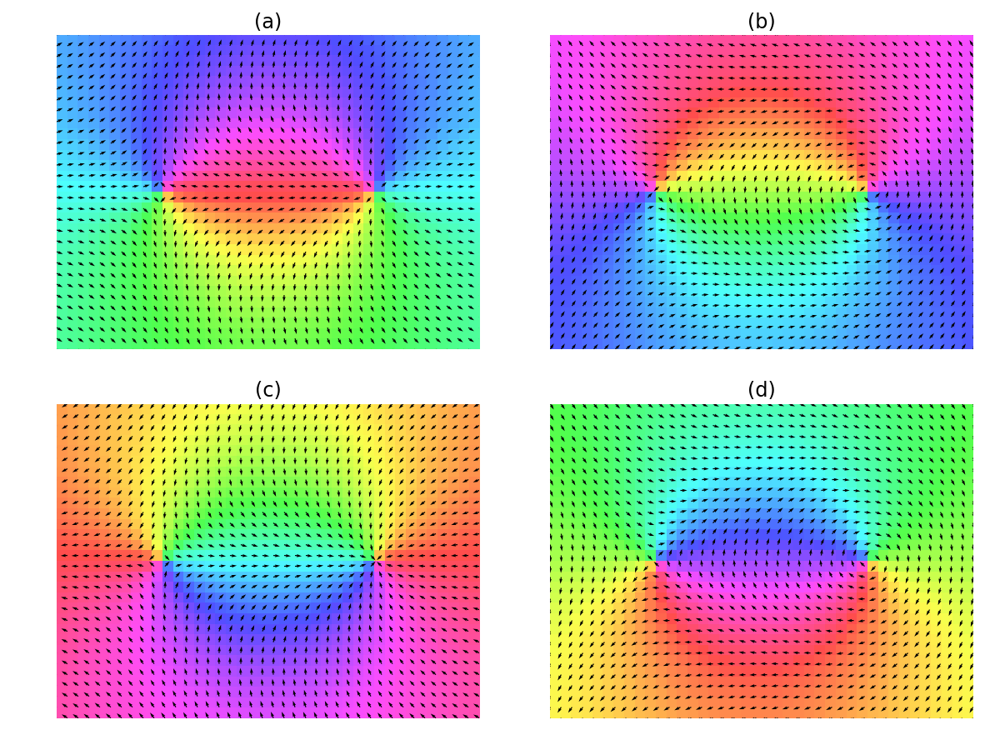

# Pair of +1/-1 defects
The director field of the defect pair, with the +1 (-1) defect positioned at *y*=0 and *x* = *a* (-*a*), is specified by
```
phi = arctan2(y, x-a) - arctan2(y, x+a) + psi
```
when `psi=0, PI/2, PI, 3/2 PI`, the correspondign director fields are shown below.


# 使用SWIG包裹C++代码生成python扩展模块

1. 准备头文件、源文件以及接口文件，例如`VMpy.h`，`VMpy.cpp`和`VMpy.i`。

2. 使用Vistual Studio生成python扩展

    1. 新建项目，步骤：**windows桌面-->windows桌面向导-->动态链接库**。添加相关的源文件、头文件以及接口文件。**注意**：需要添加一个空的`VMpy_wrap.cxx`到源文件。

    2. 设置**环境变量**: 将`PYTHON_INCLUDE`和`PYTHON_LIB`分别添加到**项目属性-->VC++目录**下的**包含目录**和**库目录**。如果用到`numpy`，需要在**包含目录**中添加`NUMPY_INCLUDE`。在**连接器-->输入-->附加依赖项**中添加`PYTHON_LIB`。本例中，环境变量如下：
        - **PYTHON_INCLUDE** C:\Users\user\Miniconda3\include
        - **PYTHON_LIB** C:\Users\user\Miniconda3\libs\python36.lib
        - **NUMPY_INCLUDE** C:\Users\user\Miniconda3\Lib\site-packages\numpy\core\include\
    
        如果编译需要用到其他头文件和库，也需要做相应的设置。
    
    3. 在`C/C++-->预处理器-->预处理器定义`中添加`SWIG_EXPORTS`。

    4. 生成`VMpy_wrap.cxx`和`VMpy.py`：右击`VMpy.i`，找到**属性-->常规-->项类型**，设为**自定义生成工具**，在**自定义生产工具**选项卡中的**命令行**添加`swig -python -c++ $(ProjectName).i`，在**输出**中添加`$(ProjectName)_wrap.cxx`。

    5. 设置输出文件：在Poject的属性页的**常规**选项卡中，设置**目标文件名**为`_$(ProjectName)`，设置**目标文件扩展名**为`.pyd`。然后在**生成事件-->生成后事件-->命令行**中输入`copy $(SolutionDir)$(Platform)\$(Configuration)\_$(ProjectName).pyd $(ProjectDir)`，这样生成的`.pyd`文件就自动的复制到工作目录下了。

    6. 生成项目。
3. 在Linux平台，写好makefile，在命令行输入`make`即可。
